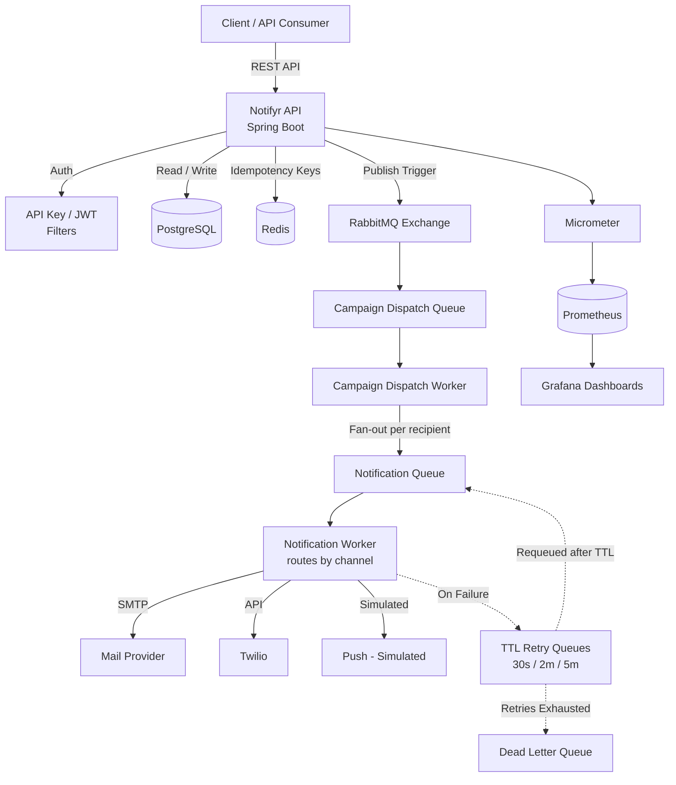
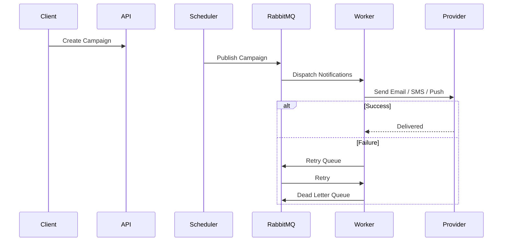

# Notifyr

> **A production-inspired bulk notification platform built with Spring Boot, RabbitMQ, Redis, PostgreSQL, and Redis for reliable asynchronous Email, SMS, and Push delivery.**

## Tech Stack

`Java 21` • `Spring Boot` • `RabbitMQ` • `Redis` • `PostgreSQL` • `Docker` • `Prometheus` • `Grafana`

---

# Table of Contents

- Features
- Architecture
- Delivery Flow
- Reliability
- Observability
- Tech Stack
- Getting Started
- API Overview
- Project Structure
- Roadmap

---

# Features

### Notification Platform

- Email delivery (SMTP)
- SMS delivery (Twilio)
- Push notifications (simulated)
- Recipient management
- Template management

### Campaign Engine

- Scheduled campaigns
- Audience segmentation
- Campaign dispatch worker
- RabbitMQ-based asynchronous processing

### Security

- JWT Authentication
- API Key Authentication
- Role-Based Access Control

### Reliability

- Redis-backed idempotency
- RabbitMQ durable queues
- TTL retry queues
- Dead Letter Queue (DLQ)

### Monitoring

- Micrometer metrics
- Prometheus
- Grafana dashboards
- Spring Boot Actuator

---

# Architecture

> Note: Email, SMS, and Push currently share a single Notification Queue and a single worker that routes to the correct provider based on the notification's channel. Dedicated per-channel queues (as originally scoped) are on the roadmap but not yet implemented.

### How it works

- Campaigns are first persisted in PostgreSQL.
- A scheduler polls for due campaigns every 30 seconds.
- Campaigns are published to RabbitMQ instead of executing in-process.
- Notification workers consume messages asynchronously.
- Failed deliveries automatically retry before eventually reaching the Dead Letter Queue.

---

# Delivery Flow



Pipeline

```text
Campaign
    ↓
Scheduler
    ↓
RabbitMQ
    ↓
Dispatch Worker
    ↓
Notification Queue
    ↓
Notification Worker
    ↓
SMTP / Twilio / Push
```

---

# Reliability

- Durable RabbitMQ queues
- Redis idempotency
- TTL retry queues (30s / 2m / 5m)
- Dead Letter Queue
- Failure-safe status tracking

---

# Observability

- Delivery throughput
- Success / failure metrics
- Retry count
- Dead Letter Queue count
- Health checks
- Grafana dashboards
- Prometheus scraping

---

# Tech Stack

| Category | Technology |
|-----------|------------|
| Language | Java 21 |
| Backend | Spring Boot |
| Database | PostgreSQL |
| Messaging | RabbitMQ |
| Cache | Redis |
| Authentication | JWT + API Key |
| Monitoring | Micrometer, Prometheus, Grafana |
| Documentation | Swagger / OpenAPI |
| Containerization | Docker & Docker Compose |

---

# Getting Started

```bash
git clone <repo-url>
cd notifyr

cp .env.example .env

docker compose up -d --build
```

### Services

| Service | URL |
|---------|-----|
| API | http://localhost:8080 |
| Swagger | http://localhost:8080/swagger-ui/index.html |
| RabbitMQ | http://localhost:15672 |
| Prometheus | http://localhost:9090 |
| Grafana | http://localhost:3000 |

---

# API Overview

### Authentication

```text
POST /auth/register
POST /auth/login
```

### Notifications

```text
POST /notifications/send
GET  /notifications/{id}
```

### Campaigns

```text
POST /campaigns
GET  /campaigns
PUT  /campaigns/{id}
POST /campaigns/{id}/send
```

📖 Full request/response schemas are available through the Swagger UI.

---

# Project Structure

```text
notifyr/
├── controller/
├── service/
├── worker/
├── scheduler/
├── security/
├── provider/
├── repository/
├── entity/
├── dto/
└── config/
```

---

# Roadmap

- [x] Email Delivery
- [x] SMS Delivery
- [x] Push Simulation
- [x] RabbitMQ Dispatch
- [x] Retry Queues
- [x] Dead Letter Queue
- [ ] Dedicated Email/SMS/Push queues
- [ ] Firebase Cloud Messaging
- [ ] Rate Limiting
- [ ] Webhooks
